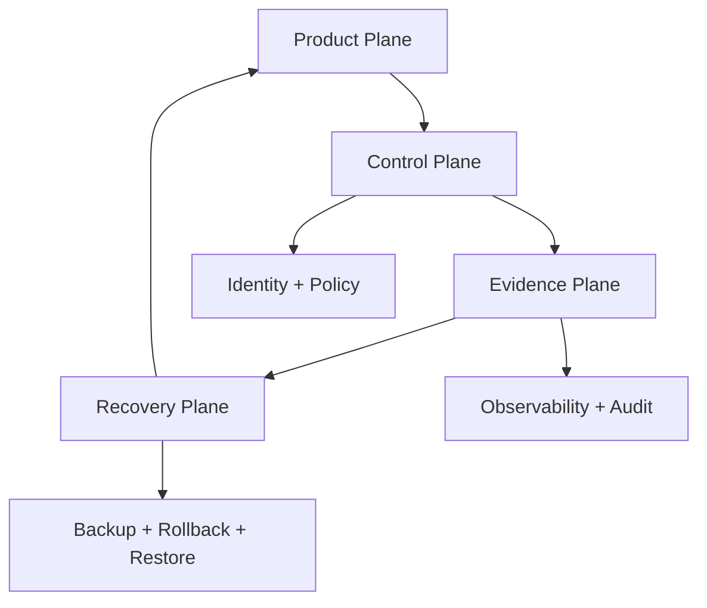

  

# DPN Technology Organization Engineering Hub

This repository powers the public DPN Technology GitHub profile and defines reusable organization-level engineering, security, release, governance and collaboration standards.

## Organization Profile

| Resource | Purpose |
| --- | --- |
| [Public organization profile](profile/README.md) | The DPN Technology GitHub Overview page |
| [Organization hero](assets/dpn-org-hero.svg) | Primary DPN GitHub identity |
| [Ecosystem map](assets/dpn-ecosystem-map.svg) | Four-domain engineering model |
| [Command fabric](assets/dpn-command-fabric.svg) | Identity, observability, automation and recovery model |
| [Operating model](assets/dpn-operating-model.svg) | Product, control, evidence and recovery planes |
| [Capability matrix](assets/dpn-capability-matrix.svg) | Cross-domain engineering capabilities |
| [Trust stack](assets/dpn-trust-stack.svg) | Security + recovery layers |
| [Maturity model](assets/dpn-maturity-model.svg) | Concept → Prototype → Development → Preview → Release |
| [Quality gates](assets/dpn-quality-gates.svg) | Architecture through operational release gates |
| [Evidence chain](assets/dpn-evidence-chain.svg) | Source → tests → security → artifacts → release → proof |
| [Supply chain](assets/dpn-supply-chain.svg) | Source/dependency/build/artifact verification path |
| [Resilience model](assets/dpn-resilience-model.svg) | Normal → degraded → isolated → recovery → restored |
| [Incident loop](assets/dpn-incident-loop.svg) | Observe → detect → contain → investigate → recover → learn |

## Engineering Standards

| Standard | Scope |
| --- | --- |
| [Engineering Standard](ENGINEERING_STANDARD.md) | Maturity, trust boundaries, observability, integration and recovery |
| [Governance](GOVERNANCE.md) | Change classes, decision rules and review expectations |
| [Quality Gates](QUALITY_GATES.md) | Architecture, source, security, test, artifact, release and operate gates |
| [Dependency Policy](DEPENDENCY_POLICY.md) | Third-party selection, commercial-use hygiene and license tracking |
| [Supply-Chain Security](SUPPLY_CHAIN_SECURITY.md) | Source-to-artifact integrity and verification |
| [Release Evidence](RELEASE_EVIDENCE.md) | Source/build/runtime/release evidence definitions |
| [Incident Response](INCIDENT_RESPONSE.md) | Evidence-preserving containment, recovery and learning |
| [Reliability Standard](RELIABILITY_STANDARD.md) | Service objectives, health signals, degraded behavior and recovery |
| [Data Handling Standard](DATA_HANDLING_STANDARD.md) | Data classification, access, retention, backup and logging |
| [Integration Contract Standard](INTEGRATION_CONTRACT_STANDARD.md) | API/event lifecycle, compatibility, observability and retirement |
| [Security Policy](SECURITY.md) | Vulnerability reporting and security guidance |
| [Contribution Standard](CONTRIBUTING.md) | Evidence-backed contribution expectations |
| [Support](SUPPORT.md) | Public project support and escalation |

## Reusable Engineering Templates

| Template | Use |
| --- | --- |
| [ADR Template](templates/ADR_TEMPLATE.md) | Durable architecture decisions |
| [Threat Model Template](templates/THREAT_MODEL_TEMPLATE.md) | Assets, actors, boundaries and abuse cases |
| [Release Checklist](templates/RELEASE_CHECKLIST.md) | Release readiness and evidence |
| [Third-Party License Template](templates/THIRD_PARTY_LICENSES_TEMPLATE.md) | Dependency and asset license tracking |
| [SLO Template](templates/SLO_TEMPLATE.md) | Reliability target and health-signal definition |
| [Data Flow Review](templates/DATA_FLOW_REVIEW.md) | Classification, access, storage and recovery review |
| [Integration Contract Template](templates/INTEGRATION_CONTRACT_TEMPLATE.md) | Versioned API/event contract definition |
| [Operational Runbook](templates/RUNBOOK_TEMPLATE.md) | Health, failure, isolation and recovery procedures |

## Community Defaults

| Path | Purpose |
| --- | --- |
| [Pull request template](.github/PULL_REQUEST_TEMPLATE.md) | Problem/scope/evidence/security/rollback review |
| [Bug report form](.github/ISSUE_TEMPLATE/bug_report.yml) | Structured public bug intake |
| [Feature request form](.github/ISSUE_TEMPLATE/feature_request.yml) | Problem-first enhancement requests |
| [Issue configuration](.github/ISSUE_TEMPLATE/config.yml) | Security-routing and blank-issue policy |
| [Code of Conduct](CODE_OF_CONDUCT.md) | Public collaboration expectations |

## Design Rule

This repository is **organization policy and presentation infrastructure**. It must not contain:

- credentials or secrets;
- private repository inventories;
- internal network details;
- private customer or employee data;
- unverified production-readiness claims.

## Core DPN Engineering Model

The goal is not maximum ceremony. The goal is **repeatable engineering decisions with visible evidence and recoverable outcomes**.

## Security

For vulnerabilities, follow [SECURITY.md](SECURITY.md). Do not disclose exploitable issues in a public issue.
