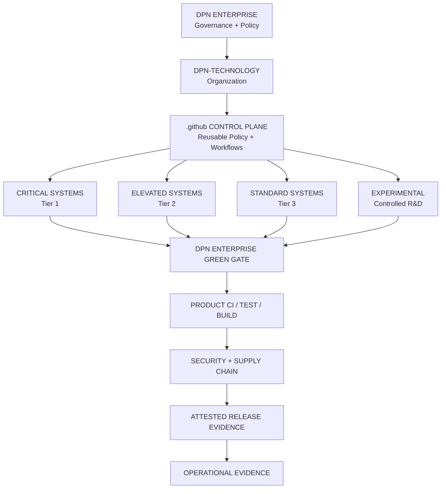

<p align="center">
  
</p>

<h1 align="center">DPN ENTERPRISE // COMMAND OVERVIEW</h1>

<p align="center">
  <strong>DEVELOP. PIONEER. NAVIGATE.</strong><br>
  Enterprise governance · engineering control · security · release trust · operational evidence
</p>

---

## ENTERPRISE STATUS

| Control Plane | State | Purpose |
| --- | --- | --- |
| **DPN Enterprise** | ACTIVE | Governance layer above the DPN-Technology organization |
| **DPN-Technology Organization** | MANAGED | Product, platform, infrastructure and public repository estate |
| **Enterprise Green Gate** | DEPLOYING | Central audit/enforcement policy engine |
| **Enterprise Rulesets** | ACTIVATION PHASE | Property-targeted repository protection |
| **Release Provenance** | READY | Artifact checksums + GitHub attestations |
| **Security Governance** | HARDENING | Code, dependency, secret and workflow controls |
| **Operational Evidence** | ACTIVE DESIGN | Source → CI → security → artifact → release → proof |

> **Enterprise operating rule:** controls begin in audit/evaluate mode, findings are remediated, then enforcement is activated. Bypass is an exception—not the normal development path.

---

## DPN ENTERPRISE

The DPN Enterprise is the top-level GitHub governance boundary for **DPN Technology**.

It exists to make the DPN engineering estate operate as one controlled ecosystem rather than a collection of independent repositories.

The Enterprise layer governs:

- repository policy and lifecycle;
- access and administrative authority;
- GitHub Actions execution;
- pull-request and branch protection;
- security and supply-chain controls;
- repository classification;
- release integrity and provenance;
- audit evidence;
- organization-wide engineering standards.

The Enterprise does **not** replace product engineering. Each repository remains responsible for truthful product-specific tests, runtime verification and release behavior.

---

## COMMAND HIERARCHY



---

## GOVERNANCE TIERS

### 🔴 CRITICAL

Identity, privileged control, security, sensitive workforce data, enterprise control planes and other high-impact systems.

**Target controls**
- Enterprise Green Gate enforced
- pull requests required
- code-owner review
- least-privilege workflow permissions
- immutable Action references
- restricted bypass
- protected releases
- artifact provenance
- rollback/recovery evidence

### 🟠 ELEVATED

Business-critical applications, infrastructure tooling, networking, service operations and distributable platforms.

**Target controls**
- Enterprise Green Gate enforced
- pull-request review
- dependency/license evidence
- explicit workflow permissions
- immutable Action references
- release checksums and provenance where distributable

### 🟢 STANDARD

Public sites, simulations, games, scripts and lower-risk products.

**Target controls**
- security policy
- protected default branch
- Enterprise Green Gate
- explicit workflow permissions
- product-specific CI
- truthful release evidence

### ⚪ EXPERIMENTAL

Prototypes and controlled research.

Experimental does **not** mean ungoverned. Baseline security and repository hygiene still apply.

---

## DPN CLASSIFICATION MODEL

DPN uses Enterprise repository properties as governance metadata.

| Property | Purpose |
| --- | --- |
| **dpn_product** | Canonical system identity |
| **lifecycle** | Concept → Prototype → Development → Preview → Release → Maintenance → Retired |
| **governance_tier** | Critical / Elevated / Standard / Experimental |
| **criticality** | Tier 1 / Tier 2 / Tier 3 / Experimental |
| **clearance** | L1 GREEN / L2 YELLOW / L3 RED / L4 PURPLE |
| **component** | Application / Service / Infrastructure / Website / Library / Simulation / Agent / Control Plane |
| **customer_facing** | External dependency indicator |
| **release_channel** | Dev / Beta / Stable / None |
| **security_tier** | Baseline / Elevated / Critical |

This metadata becomes the targeting language for Enterprise rulesets and security policy.

---

## CLEARANCE MODEL

| Clearance | Classification | Use |
| --- | --- | --- |
| 🟢 **L1 GREEN** | Public | Public-safe engineering and product information |
| 🟡 **L2 YELLOW** | Staff | Internal operational information |
| 🔴 **L3 RED** | Executive | Sensitive business, identity and system-control information |
| 🟣 **L4 PURPLE** | Critical Infrastructure | Highest-impact operational/control information |

GitHub repository visibility and DPN clearance are related but not interchangeable. A private repository is not automatically L4, and an L1 project may still be privately developed.

---

## ENTERPRISE TRUST PIPELINE

```text
SOURCE
  ↓
PULL REQUEST
  ↓
ENTERPRISE RULESET
  ↓
DPN ENTERPRISE GREEN GATE
  ↓
PRODUCT CI / TEST / BUILD
  ↓
CODE + DEPENDENCY + SECRET + SUPPLY-CHAIN CHECKS
  ↓
APPROVED MERGE
  ↓
BUILD ARTIFACT
  ↓
SHA-256 + GITHUB ARTIFACT ATTESTATION
  ↓
RELEASE EVIDENCE
  ↓
OPERATIONAL VERIFICATION
```

A green badge is not the objective. The objective is a traceable answer to:

1. **What changed?**
2. **Who authorized it?**
3. **What verified it?**
4. **What source produced the artifact?**
5. **What third-party components are included?**
6. **How can it be recovered or rolled back?**

---

## ENTERPRISE SECURITY MODEL

### Identity
Least privilege, minimal administrative authority, team-based access and controlled automation identities.

### Source
Protected branches, pull requests, ownership review and explicit bypass policy.

### Automation
Read-only workflow tokens by default, immutable third-party Action references and reviewed privileged events.

### Dependencies
Dependency inventory, vulnerability review and third-party licensing separation.

### Secrets
No credentials in source. Secret scanning and push protection are enabled where supported/licensed.

### Releases
Checksums, provenance attestations and controlled release authority for distributable products.

### Evidence
Security claims must be backed by source, workflow, artifact or runtime evidence.

---

## ENTERPRISE OPERATING PLAN

### PHASE 1 // INVENTORY
Repository estate classified and governance metadata established.

### PHASE 2 // AUDIT
Enterprise Green Gate reports inconsistent permissions, Action pinning, sensitive files and missing governance evidence.

### PHASE 3 // REMEDIATE
Legacy security gates, CI failures and policy findings are repaired.

### PHASE 4 // ENFORCE
Enterprise rulesets become active and clean repositories move from `audit` to `enforce`.

### PHASE 5 // TRUSTED RELEASES
Release-producing systems use checksums, attestations, dependency evidence and rollback procedures.

### PHASE 6 // CONTINUOUS GOVERNANCE
Audit logs, app access, PATs, ruleset bypass, stale permissions, releases and repository lifecycle are reviewed continuously.

---

## ENTERPRISE CONTROL PLANE RESOURCES

| Resource | Location |
| --- | --- |
| Enterprise policy | `DPN-Technology/.github/enterprise/policy.yml` |
| Repository classification | `DPN-Technology/.github/enterprise/repositories.yml` |
| Ruleset architecture | `DPN-Technology/.github/enterprise/RULESETS.md` |
| Actions policy | `DPN-Technology/.github/enterprise/ACTIONS_POLICY.md` |
| Access model | `DPN-Technology/.github/enterprise/ACCESS_MODEL.md` |
| Security rollout | `DPN-Technology/.github/enterprise/SECURITY_ROLLOUT.md` |
| Admin activation | `DPN-Technology/.github/enterprise/ADMIN_ACTIVATION.md` |
| Enterprise Green Gate | `DPN-Technology/.github/.github/workflows/dpn-green-gate.yml` |
| Required ruleset workflow | `DPN-Technology/.github/.github/workflows/dpn-enterprise-ruleset.yml` |
| Artifact provenance | `DPN-Technology/.github/.github/workflows/dpn-enterprise-artifact-attest.yml` |

---

## COMMAND PRINCIPLES

**Develop what does not exist.**  
Build systems around real operational needs.

**Pioneer what comes next.**  
Push automation, infrastructure, AI and engineering beyond isolated tools.

**Navigate the future.**  
Keep systems observable, controllable, secure, recoverable and connected.

---

<p align="center">
  <strong>DPN ENTERPRISE // DEVELOP. PIONEER. NAVIGATE.</strong><br>
  <sub>Centralized governance. Distributed engineering. Verifiable evidence.</sub>
</p>
