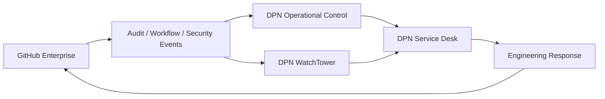

<p align="center">
  
</p>

# DPN Enterprise // Control Plane

<p align="center">
  <strong>DEVELOP. PIONEER. NAVIGATE.</strong><br>
  Enterprise governance for the DPN Technology engineering estate.
</p>

<p align="center">
  
  
  
</p>

---

## Enterprise Mission

**DPN Enterprise** is the governance layer above the **DPN-Technology** organization.

Its job is to make engineering policy consistent across the DPN ecosystem while keeping controls proportional to risk. Repository access, workflow execution, required evidence, release trust, security posture, and bypass authority should be governed deliberately rather than independently reinvented by every project.

> **Enterprise policy defines the floor. Organization and repository controls may become stricter, but they should not silently weaken it.**

## Current Control Status

| Control | State | Direction |
| --- | --- | --- |
| Enterprise Overview README | **CANONICAL READY** | Publish this reviewed file from the Enterprise Overview editor |
| Enterprise source of truth | **ESTABLISHED** | Versioned in the public DPN `.github` control plane |
| Repository classification | **20 / 20 BASELINED** | Maintain through Enterprise custom properties |
| Enterprise Green Gate | **OPERATIONAL** | Audit first, enforce after remediation |
| Enterprise Ruleset Gate | **OPERATIONAL** | Designed for centrally required workflows |
| Enterprise custom properties | **DEFINED** | Activate in Enterprise settings |
| E0/E1/E2/E3 rulesets | **DESIGNED** | Evaluate → Active |
| Actions execution policy | **DEFINED** | Activate at Enterprise level |
| Programmatic access policy | **DEFINED** | Enforce PAT/App governance |
| Release provenance | **AVAILABLE** | Expand to all distributable products |
| Security configuration tiers | **ROLLOUT** | Apply where licensed and supported |

## Enterprise Command Matrix

| Domain | Enterprise owner decision | Organization implementation | Repository evidence |
| --- | --- | --- | --- |
| **Identity** | Who may administer the Enterprise | Org owners, teams, custom roles | CODEOWNERS / access reviews |
| **Source Control** | Global merge and bypass policy | Organization rulesets | PR history + required checks |
| **Actions** | Allowed execution model | Reusable workflows / runner policy | Explicit permissions + SHA pins |
| **Security** | Security configuration baseline | Security configuration targeting | Code/dependency/secret findings |
| **Supply Chain** | Trusted build requirements | Shared attestation workflow | Checksums + provenance |
| **Release** | Promotion authority | Release managers / environments | Version + artifacts + rollback |
| **Audit** | Retention and review expectations | Enterprise/organization audit | Exceptions + bypass evidence |
| **Operations** | Integration and recovery policy | DPN Operational Control / WatchTower | Health, incident, recovery evidence |

### Enterprise promotion ladder

```text
DEFINED
   ↓
AUDIT / EVALUATE
   ↓
FINDINGS REMEDIATED
   ↓
ENFORCED / ACTIVE
   ↓
MEASURED
   ↓
REVIEWED
   ↓
IMPROVED
```

No DPN control should jump directly from **defined** to **enforced** without evidence that the affected repositories can comply.

## Executive Control Objectives

### 01 // CONTROL THE BLAST RADIUS
Critical repositories receive stronger rules, narrower bypass authority and stronger release evidence than ordinary development repositories.

### 02 // MAKE POLICY MACHINE-READABLE
Enterprise custom properties classify repositories so policy follows system purpose automatically.

### 03 // CENTRALIZE WITHOUT CREATING A MONOLITH
The Enterprise defines the floor. Product repositories keep their own language-specific tests, builds and runtime validation.

### 04 // PROVE RELEASE ORIGIN
Distributable DPN artifacts should be connected to protected source, a specific commit, checksums and GitHub provenance attestations.

### 05 // MAKE EXCEPTIONS VISIBLE
A bypass must have an actor, reason, risk owner, compensating control and follow-up. Silent bypass is not accepted governance.

## Policy Activation Dashboard

| Priority | Control | Target state |
| --- | --- | --- |
| **P0** | Enterprise owner / organization owner review | Minimal privileged administrators |
| **P1** | Enterprise custom properties | Created and assigned to all governed repos |
| **P2** | E0 Enterprise Baseline ruleset | Evaluate → Active |
| **P2** | E1 Elevated ruleset | Property-targeted and Active |
| **P2** | E2 Critical ruleset | Property-targeted, restricted bypass |
| **P2** | E3 Public Surface ruleset | Public-safe engineering baseline |
| **P3** | Actions execution policy | Read-only defaults + reviewed events/actions |
| **P4** | Fine-grained PAT policy | Approval + bounded lifetime |
| **P5** | Repository lifecycle controls | Creation, deletion, transfer, visibility governed |
| **P6** | Security configurations | Applied by tier where licensed |
| **P7** | Trusted releases | Provenance/checksums on distributable products |


## DPN Governance Estate

The Enterprise currently governs **20 repositories** under the DPN Technology organization.

| Governance tier | Repositories | Control intent |
| --- | ---: | --- |
| **Critical** | 8 | Identity, control-plane, privileged, security-sensitive, or sensitive workforce systems |
| **Elevated** | 5 | Infrastructure, operating systems, network/service operations, or business-critical systems |
| **Standard** | 7 | Public surfaces, simulations, games, scripts, and lower-risk applications |
| **Experimental** | 0 | Prototype/exploratory repositories with audit-first controls |

### Clearance distribution

| DPN clearance | Repositories | Enterprise handling |
| --- | ---: | --- |
| **L4 PURPLE** | 3 | Critical-infrastructure governance |
| **L3 RED** | 7 | Restricted engineering / privileged systems |
| **L2 YELLOW** | 2 | Staff/business operations |
| **L1 GREEN** | 8 | Public-safe / general engineering |

The canonical Overview source is stored in a **public** control-plane repository, so it intentionally publishes only aggregate estate counts and already-public repository details. The complete private/internal property assignment inventory is maintained separately in a private operational source of truth.

<p align="center">
  
</p>

## Enterprise Control Hierarchy

```text
DPN ENTERPRISE
│
├── Enterprise identity + access policy
├── Enterprise custom properties
├── Enterprise rulesets
├── Enterprise GitHub Actions policy
├── Programmatic access / PAT / App policy
│
└── DPN-Technology Organization
    │
    ├── .github Enterprise Control Plane
    │   ├── DPN Enterprise Ruleset Gate
    │   ├── DPN Enterprise Green Gate
    │   ├── Reusable CI
    │   ├── Security / supply-chain workflows
    │   └── Artifact provenance
    │
    └── Product Repositories
        ├── Product-specific CI
        ├── Security evidence
        ├── Dependency/license evidence
        ├── Release evidence
        └── Operational / recovery evidence
```

## Ruleset Stack

| Layer | Target | Enterprise expectation |
| --- | --- | --- |
| **E0 — Baseline** | Maintained repositories | PRs, required checks, conversation resolution, no force-push/deletion |
| **E1 — Elevated** | `governance_tier=elevated` | Approval, ownership, dependency evidence, release provenance |
| **E2 — Critical** | `governance_tier=critical` | Code-owner review, restricted bypass, protected tags, security gates, provenance |
| **E3 — Public Surface** | Public repositories | Public-safe content, security policy, least-privilege workflows, secret hygiene |

The target model uses **Enterprise custom properties** as the ruleset targeting language so policy follows repository purpose instead of relying on fragile hand-maintained repository lists.

## Enforcement Workflow Matrix

| Ruleset | Target | Required workflow | Gate posture |
| --- | --- | --- | --- |
| **E0 Baseline** | Maintained repositories | `dpn-enterprise-ruleset.yml` | Audit/Evaluate during rollout |
| **E1 Elevated** | `governance_tier=elevated` | `dpn-enterprise-elevated-ruleset.yml` | Enforce repository evidence and workflow security |
| **E2 Critical** | `governance_tier=critical` | `dpn-enterprise-critical-ruleset.yml` | Enforce strict ownership, dependency and workflow controls |
| **E3 Public Surface** | `visibility=public` | `dpn-enterprise-public-ruleset.yml` | Enforce public-safe baseline |

These workflows are separate entry points for GitHub rulesets but delegate evaluation to the same **DPN Enterprise Green Gate**. This keeps policy logic centralized while allowing Enterprise rulesets to apply different severity levels.

### Critical / Elevated enforcement contract

A Critical or Elevated repository is not ready for enforcement until it has:

- a security policy;
- CODEOWNERS;
- an Enterprise-grade pull request template;
- third-party dependency/license evidence;
- immutable SHA-pinned external Actions;
- explicit workflow permissions;
- stable repository-specific CI;
- release provenance when it publishes distributable artifacts.

## Source vs. Effective State

The Overview intentionally distinguishes **what is defined in source** from **what is active in GitHub Enterprise settings**.

| Plane | Source-controlled state | Effective Enterprise state |
| --- | --- | --- |
| Property schema | Defined | Requires Enterprise-owner activation |
| Repository assignments | Internal inventory ready | Requires values to be applied |
| E0/E1/E2/E3 rulesets | Machine-readable definitions ready | Start Evaluate, then Active |
| Required workflows | Implemented | Attach to the matching rulesets |
| Actions policy | Defined | Requires Enterprise policy configuration |
| PAT/App policy | Defined | Requires Enterprise policy configuration |
| Security configurations | Designed | Apply where licensed |
| Artifact provenance | Reusable workflow available | Enable per release-producing repository |

**DPN does not call a control ACTIVE merely because the Markdown or YAML exists.**


## Enterprise Integration Fabric

DPN Enterprise governance is intended to feed the wider DPN operational ecosystem rather than remain isolated inside GitHub.



### Integration contract

Future integrations should preserve:

- authenticated event origin;
- least-privilege GitHub App scopes;
- replay protection;
- event identifiers and timestamps;
- durable audit records;
- failure/retry behavior;
- secret rotation;
- no exposure of higher-clearance data into public systems.

GitHub becomes a **source of engineering truth**, while DPN Operational Control becomes the operational correlation layer.

## Release Trust Plane

For release-producing repositories, the target evidence chain is:

```text
PROTECTED SOURCE
  → REQUIRED CHECKS
  → APPROVED MERGE
  → REPEATABLE BUILD
  → ARTIFACT INVENTORY
  → SHA-256
  → GITHUB ATTESTATION
  → RELEASE RECORD
  → INSTALL / UPGRADE GUIDANCE
  → ROLLBACK / RECOVERY
```

A DPN release is not considered strongly evidenced merely because a tag exists.

## Security + Trust Model

<p align="center">
  
</p>

DPN Enterprise security is built around:

- least privilege for people, workflows, tokens, Apps, and runners;
- explicit GitHub Actions permissions;
- immutable SHA-pinned third-party Actions;
- protected pull-request and merge paths;
- security and dependency evidence;
- restricted bypass authority;
- checksums and artifact attestations for distributable releases;
- rollback and recovery evidence for privileged changes;
- auditability of policy, exceptions, and promotion decisions.

## Evidence-Driven Engineering

<p align="center">
  
</p>

A green badge alone is not release evidence. DPN distinguishes:

**source verified → test verified → security verified → artifact verified → release verified → operationally verified**

The Enterprise control plane exists to make that evidence visible and increasingly enforceable.

## Enterprise Quick Access

| Resource | Purpose |
| --- | --- |
| [DPN Technology Organization](https://github.com/DPN-Technology) | Organization and repository estate |
| [Enterprise Control Plane Source](https://github.com/DPN-Technology/.github/tree/main/enterprise) | Versioned Enterprise governance |
| [Enterprise Policy](https://github.com/DPN-Technology/.github/blob/main/enterprise/policy.yml) | Machine-readable control baseline |
| [Public Estate Summary](https://github.com/DPN-Technology/.github/blob/main/enterprise/repositories.yml) | Public-safe aggregate governance counts and public repository properties |
| [Ruleset Architecture](https://github.com/DPN-Technology/.github/blob/main/enterprise/RULESETS.md) | E0/E1/E2/E3 enforcement model |
| [Machine-readable Rulesets](https://github.com/DPN-Technology/.github/blob/main/enterprise/rulesets.yml) | Ruleset targets, required workflows and promotion requirements |
| [Actions Policy](https://github.com/DPN-Technology/.github/blob/main/enterprise/ACTIONS_POLICY.md) | Workflow and runner trust model |
| [Access Model](https://github.com/DPN-Technology/.github/blob/main/enterprise/ACCESS_MODEL.md) | Roles, teams, PATs and GitHub Apps |
| [Security Rollout](https://github.com/DPN-Technology/.github/blob/main/enterprise/SECURITY_ROLLOUT.md) | Audit → security configuration → enforce |
| [Enterprise Activation Tracker](https://github.com/DPN-Technology/.github/issues/5) | Enterprise-owner activation work |
| [DPN GitHub Command Center](https://dpn-technology.github.io/) | Public-safe DPN engineering command center |


## Enterprise Health Definition

The Enterprise should be considered **GREEN** only when all of the following are true:

- no unresolved critical policy violations;
- critical repositories are on enforced governance;
- required workflows are reporting reliably;
- no known exposed secrets remain unresolved;
- release-producing critical/elevated repositories have provenance controls;
- Enterprise/organization bypass use is explainable and reviewed;
- access is aligned to least privilege;
- failing security gates represent real findings rather than broken automation;
- the source-controlled policy matches the effective GitHub settings.

### Status language

| State | Meaning |
| --- | --- |
| **GREEN** | Required controls pass and effective settings match policy |
| **AMBER** | Development may continue, but known governance findings remain |
| **RED** | Required policy is failing or a high-impact control is missing |
| **PURPLE** | Critical infrastructure/security escalation requiring executive attention |

## Rollout State

### ACTIVE NOW
- source-controlled Enterprise policy;
- repository governance tiers;
- Enterprise Green Gate;
- Enterprise Ruleset Gate;
- reusable organization CI;
- supply-chain/release evidence standards;
- artifact provenance workflow;
- automated control-plane validation.

### ENTERPRISE OWNER ACTIVATION
- create Enterprise custom properties;
- apply property values to repositories;
- enable E0 baseline ruleset in **Evaluate** mode;
- configure Enterprise Actions execution policy;
- configure fine-grained PAT approval/lifetime policy;
- apply security configurations where licensed;
- promote clean repositories from **Audit → Enforce**;
- promote validated rulesets from **Evaluate → Active**.

## Operating Doctrine

**Develop** — build systems with explicit ownership, evidence, and recovery.

**Pioneer** — use Enterprise capabilities to raise the engineering floor without creating useless ceremony.

**Navigate** — measure the estate, surface exceptions, and move controls from advisory to enforced only when evidence says the organization is ready.

---

<p align="center">
  <strong>DPN ENTERPRISE CONTROL PLANE</strong><br>
  <sub>Policy → Identity → Source → Security → Evidence → Release → Recovery</sub>
</p>
