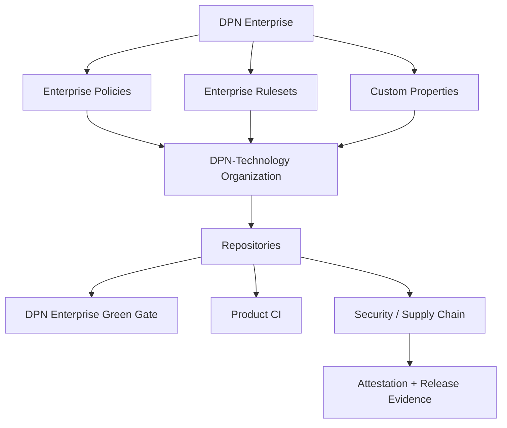

# DPN Enterprise Control Plane

This directory is the source-controlled design for the GitHub Enterprise account that governs the `DPN-Technology` organization.

The Enterprise account is treated as a governance layer above the organization, not as a billing wrapper.

## Goals

- make policy consistent across every repository;
- separate enterprise, organization, and repository responsibilities;
- classify repositories so stronger controls can target higher-risk systems;
- centralize Actions, access, ruleset, release and security expectations;
- preserve evidence of why a control exists and how it should be rolled out;
- keep DPN development usable while controls move from audit to enforcement.

## Source of truth

| File | Purpose |
| --- | --- |
| [OVERVIEW.md](OVERVIEW.md) | Canonical content for the GitHub Enterprise Overview README |
| [policy.yml](policy.yml) | Machine-readable Enterprise defaults and governance tiers |
| [repositories.yml](repositories.yml) | Public-safe estate summary and public repository property mirror |
| [CUSTOM_PROPERTIES.md](CUSTOM_PROPERTIES.md) | GitHub Enterprise custom-property design |
| [custom-properties.schema.json](custom-properties.schema.json) | API-shaped custom property definitions |
| [RULESETS.md](RULESETS.md) | Layered Enterprise ruleset architecture |
| [rulesets.yml](rulesets.yml) | Machine-readable E0/E1/E2/E3 targets and required workflows |
| [ACTIONS_POLICY.md](ACTIONS_POLICY.md) | Enterprise GitHub Actions policy |
| [ACCESS_MODEL.md](ACCESS_MODEL.md) | Identity, roles, teams and token posture |
| [SECURITY_ROLLOUT.md](SECURITY_ROLLOUT.md) | Security configuration and enforcement rollout |
| [ADMIN_ACTIVATION.md](ADMIN_ACTIVATION.md) | Settings that must be activated by an Enterprise owner |
| [EFFECTIVE_STATE.md](EFFECTIVE_STATE.md) | Verified GitHub settings vs source-controlled target |

## Control hierarchy

## Rollout rule

New controls start in **audit/evaluate** mode where possible. They become enforced only after the affected repositories can satisfy them without bypassing legitimate development.

## Enterprise Overview README

GitHub Enterprise Cloud supports an Enterprise README on the Enterprise **Overview** landing page. The canonical DPN content is maintained in [OVERVIEW.md](OVERVIEW.md).

Because the Enterprise Overview editor is an Enterprise-owner setting rather than a repository file, update the GitHub Enterprise Overview from this canonical source after changes are reviewed and merged.

The Enterprise Overview is member-facing, but its canonical source lives in the public DPN control-plane repository. For that reason, the canonical source must remain public-safe and must not contain private repository identities, private topology, credentials, or restricted operational details.
