

  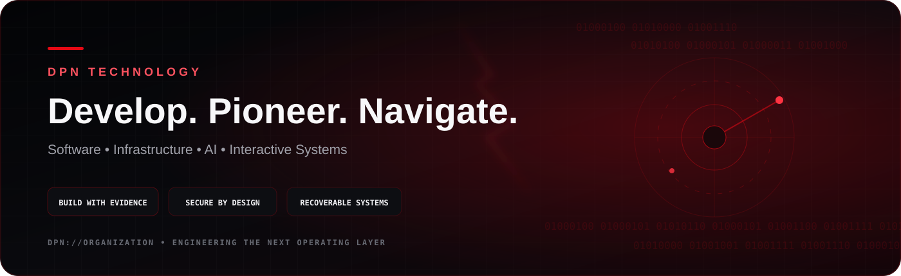

  <strong>We Develop what doesn’t exist. We Pioneer what comes next. We Navigate the future.</strong>

  
  
  
  

## DPN Technology

**DPN Technology** is an engineering organization focused on building practical software, infrastructure, AI tooling, operational systems, and interactive experiences.

Our work spans four connected domains:

  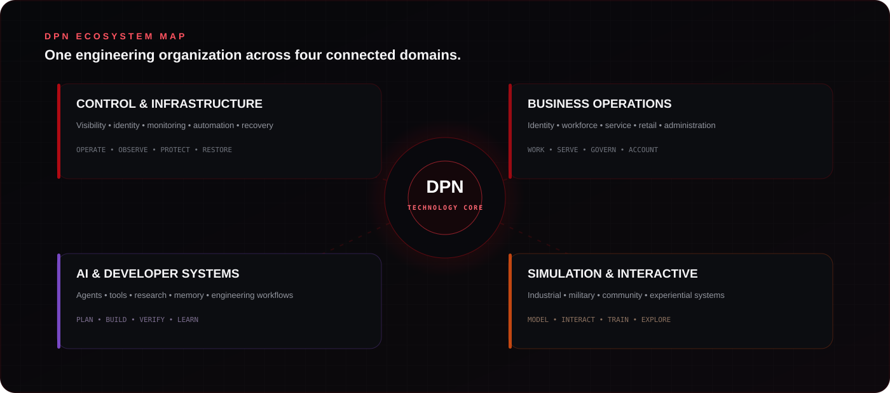

| Domain | What we build |
| --- | --- |
| **Control & Infrastructure** | Operational visibility, identity, monitoring, automation, endpoint control, recovery and systems management |
| **Business Operations** | Workforce, service, retail, administration, internal operations and connected business tooling |
| **AI & Developer Systems** | Agent workflows, coding tools, research, memory, automation and software engineering systems |
| **Simulation & Interactive** | Industrial simulation, military simulation, community experiences and interactive software |

> Some DPN projects are developed privately and are intentionally not enumerated on this public profile. Public claims are kept tied to public evidence.

## Public Work

### DPN FiveM Resource Library

[**DPN-QB-FiveM-Scripts**](https://github.com/DPN-Technology/DPN-QB-FiveM-Scripts) is the current public repository in the DPN Technology organization.

It contains an expanding collection of QBCore, hybrid and standalone FiveM resources, including a unified emergency-services stack with dispatch, MDT, law-enforcement, medical and supporting systems.

  

<!-- DPN-ADVANCED-SYSTEMS:START -->

## DPN Command Fabric

  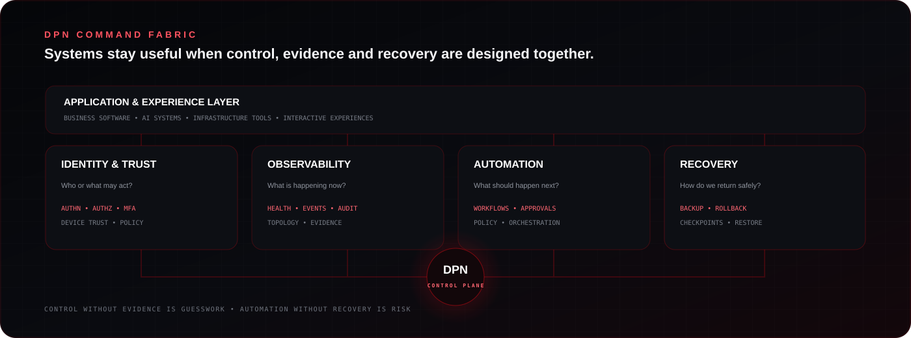

DPN systems are designed around a shared operating model rather than isolated applications:

- **Identity & Trust** decides who or what may act.
- **Observability** records what is happening and why.
- **Automation** moves approved work forward.
- **Recovery** provides a deliberate path back to a known state.
- **Applications and experiences** sit on top of those capabilities instead of reimplementing them independently.

This is the direction of the platform: connected systems with explicit control planes, observable state, bounded authority and recoverable failure.

## Engineering Capability Matrix

  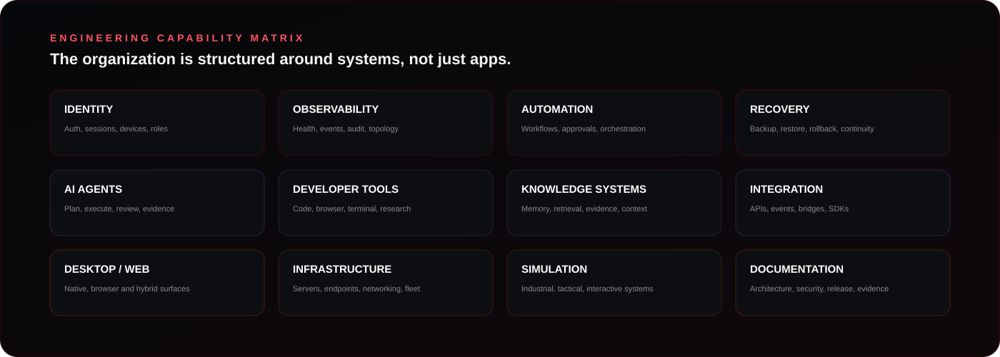

The organization works across infrastructure, software, AI and simulation, but the underlying engineering capabilities are intentionally reusable. Identity, telemetry, automation, recovery, integration and evidence should become common building blocks rather than one-off implementations.

## Trust, Security & Recovery

  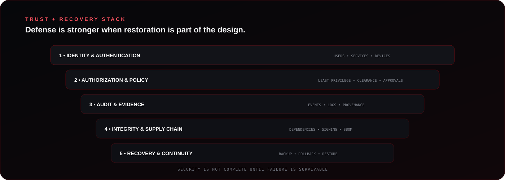

DPN treats security and recovery as one system. A control that can block an action but cannot explain it, audit it or recover from failure is incomplete.

| Layer | Design intent |
| --- | --- |
| **Identity & Authentication** | Establish the actor: user, service, device or workload |
| **Authorization & Policy** | Bound what the actor may do and under which conditions |
| **Audit & Evidence** | Preserve the record of privileged and material actions |
| **Integrity & Supply Chain** | Track dependencies, provenance, signing and externally licensed components |
| **Recovery & Continuity** | Design rollback, restore and degraded operation before failure occurs |

## Maturity & Release Evidence

  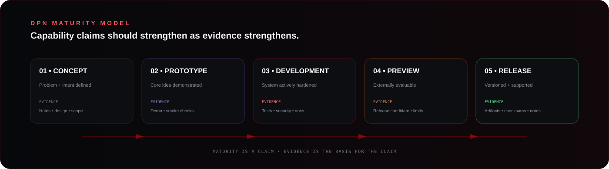

DPN does not treat every repository or feature as equally mature. The intended progression is:

**Concept → Prototype → Development → Preview → Release**

Moving right requires stronger evidence: repeatable tests, security review, architecture documentation, known limitations, release artifacts and recovery/rollback considerations.

That model exists to keep the presentation ambitious **without confusing ambition with proof**.

## Public Engineering Telemetry

  
  
  

These badges reflect only the currently public repository. They are intentionally not presented as an organization-wide health score.

## Operating Model

  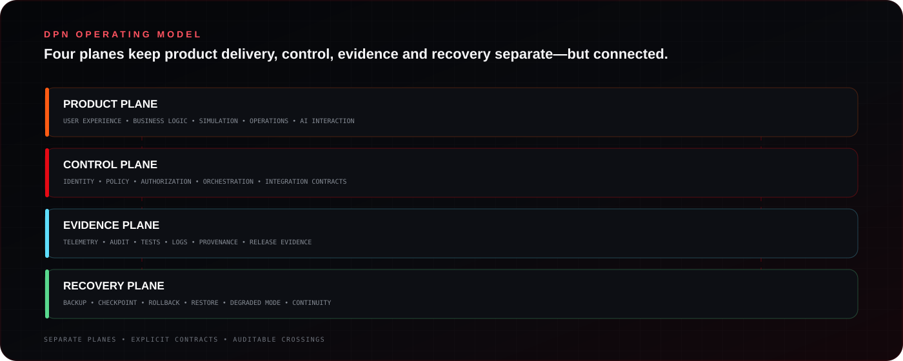

The DPN operating model separates product delivery from the planes that make it controllable and trustworthy:

- **Product Plane** — what users interact with and what the system actually does.
- **Control Plane** — identity, policy, authorization, orchestration and integration.
- **Evidence Plane** — telemetry, tests, audit, provenance and release evidence.
- **Recovery Plane** — backup, checkpointing, rollback, restoration and continuity.

That separation makes it easier to improve one concern without burying it inside every application.

## Evidence Chain

  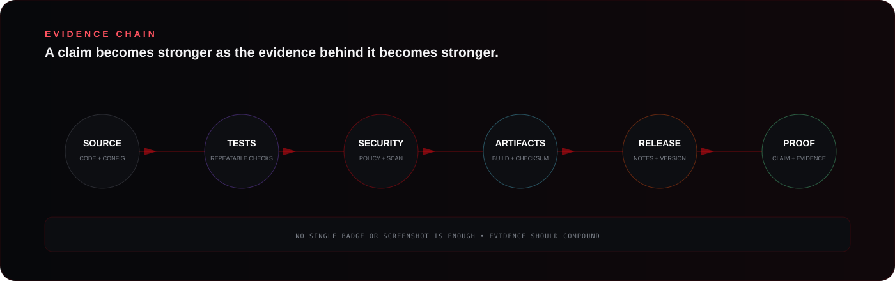

DPN treats evidence as cumulative. Source, tests, security review, build artifacts and release documentation each strengthen a claim—but none should be treated as a substitute for the others.

## Resilience Model

  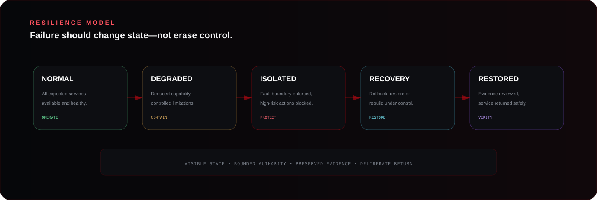

A resilient DPN system should make transitions explicit:

**Normal → Degraded → Isolated → Recovery → Restored**

The goal is not pretending failure never happens. The goal is keeping authority, evidence and recovery paths intact when it does.

## Organization Engineering Standards

| Standard | Purpose |
| --- | --- |
| [Engineering Standard](../ENGINEERING_STANDARD.md) | Maturity, trust boundaries, observability, integration and recovery expectations |
| [Dependency Policy](../DEPENDENCY_POLICY.md) | Third-party selection, commercial-use hygiene and license tracking |
| [Release Evidence Standard](../RELEASE_EVIDENCE.md) | Source/build/runtime/release verification and artifact expectations |
| [Security Policy](../SECURITY.md) | Vulnerability reporting and security guidance |
| [Contribution Standard](../CONTRIBUTING.md) | Reviewable, evidence-backed contribution expectations |
| [Support](../SUPPORT.md) | Public project support and escalation guidance |

## Systems Doctrine

| Principle | DPN interpretation |
| --- | --- |
| **Truth over theater** | Visual polish should make real state easier to understand, not manufacture confidence |
| **Bounded control** | Privileged actions should have explicit authority, scope and auditability |
| **Evidence attached** | Tests, logs, screenshots, checksums and release artifacts should support important claims |
| **Recoverability by design** | Backups, rollback, checkpointing and restoration are planned capabilities |
| **Loose coupling** | Integration should happen through stable contracts, events or APIs rather than hidden dependencies |
| **Commercial-use hygiene** | Third-party components and licenses should be tracked separately from DPN-owned code |
| **Operator clarity** | Interfaces should make state, risk and next actions obvious |
| **Progressive hardening** | Projects may begin as prototypes, but maturity should be visible and documented as controls improve |

<!-- DPN-ADVANCED-SYSTEMS:END -->

## Engineering Principles

<table>
<tr>
<td width="50%">

### Evidence before claims

A polished interface is not proof that a capability is production-ready. DPN documentation is expected to distinguish prototypes, development systems, previews and validated releases.

### Security is a system property

Authentication, authorization, audit, secret handling, dependency hygiene, signed artifacts and recovery all matter. Security is not treated as one workflow file or one scanner.

</td>
<td width="50%">

### Recoverability matters

Systems should fail visibly, preserve evidence, support rollback and provide a path back to a known state.

### Local-first where practical

Many DPN systems are designed for self-hosted or local operation so owners retain control of infrastructure, data and runtime decisions.

</td>
</tr>
</table>

  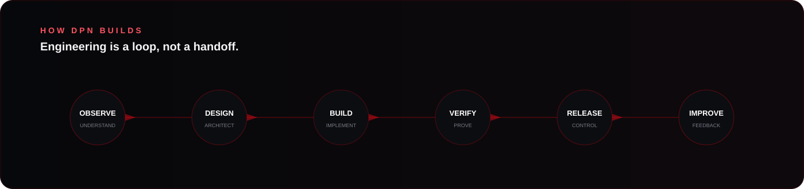

## How We Think About Systems

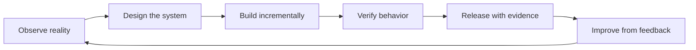

Every system should answer six questions:

1. **What problem does it solve?**
2. **What evidence proves it works?**
3. **Who or what is allowed to control it?**
4. **How does it fail?**
5. **How does it recover?**
6. **How does it integrate without becoming tightly coupled?**

## Security

Security issues should **not** be posted as public issues when disclosure could expose users, credentials, infrastructure or sensitive implementation details.

Use the repository's **Security** tab and private vulnerability reporting where available. Repository-specific `SECURITY.md` files take precedence over the [organization security policy](../SECURITY.md).

## Contributing

Public contributions should be scoped, reviewable and evidence-backed. Pull requests should explain:

- the problem being solved;
- the implementation boundary;
- tests or verification performed;
- security or dependency impact;
- rollback considerations when applicable.

See [CONTRIBUTING.md](../CONTRIBUTING.md) for the organization contribution standard.

## Reliability, Data & Integration

### Reliability as an operating contract

  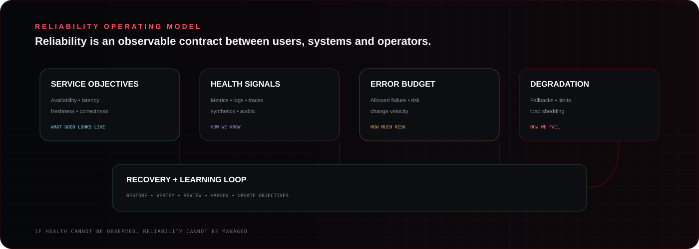

DPN reliability work is organized around **service objectives, real health signals, explicit degraded behavior, risk-aware change velocity, recovery and learning**.

A green interface is not a reliability signal by itself. Health should come from measurements that can explain what the system is doing.

Read the [Reliability Standard](../RELIABILITY_STANDARD.md).

### Data handling by sensitivity

  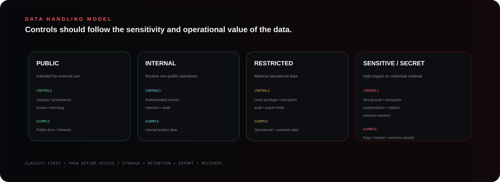

Data controls should match the value and sensitivity of the information being handled. DPN uses a simple public model:

**Public → Internal → Restricted → Sensitive / Secret**

Classification should drive access, encryption, retention, export, backup and incident-response decisions.

Read the [Data Handling Standard](../DATA_HANDLING_STANDARD.md).

### Integration contracts have a lifecycle

  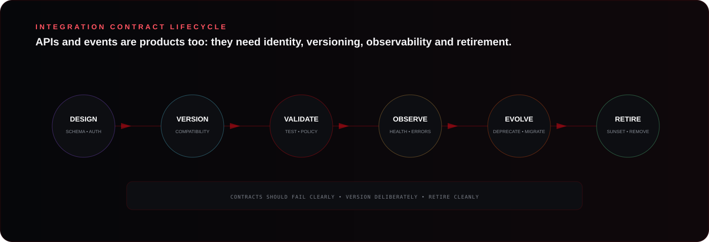

DPN treats durable APIs, events and SDK contracts as products with their own lifecycle:

**Design → Version → Validate → Observe → Evolve → Retire**

The objective is to avoid silent breaking changes, invisible consumers and integrations that cannot explain failure.

Read the [Integration Contract Standard](../INTEGRATION_CONTRACT_STANDARD.md).

## Quality & Trust Operations

  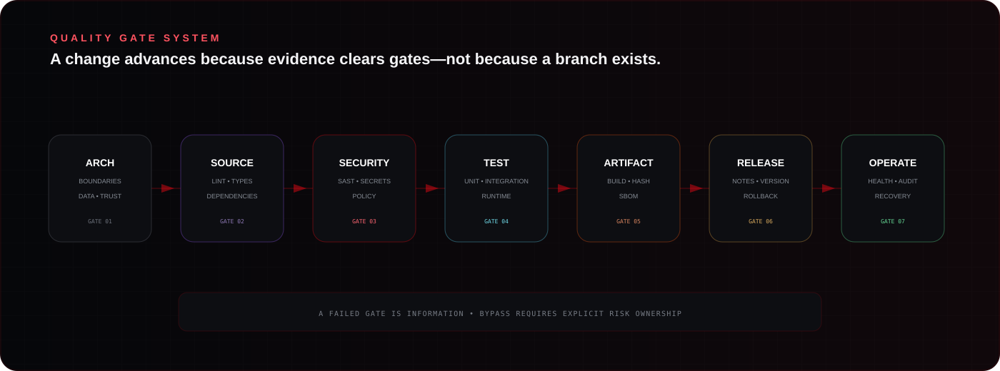

DPN quality gates are intended to turn evidence into explicit promotion decisions. Architecture, source quality, security, testing, artifact integrity, release readiness and operational recovery are treated as separate gates because passing one does not prove the others.

Read the [DPN Quality Gates standard](../QUALITY_GATES.md).

### Software Supply-Chain Trust

  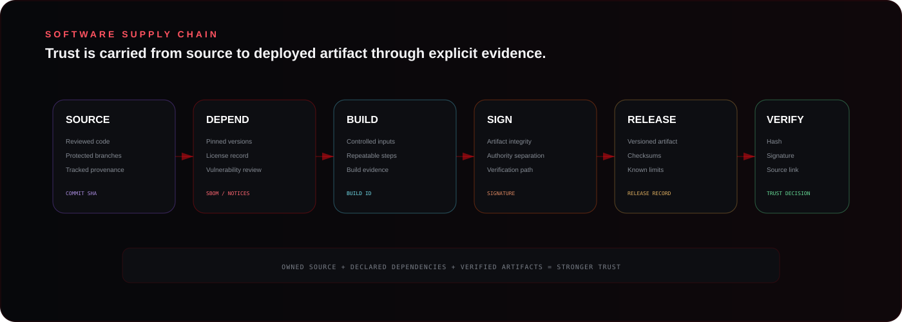

The preferred trust chain is:

**Source → Dependencies → Build → Signing/Integrity → Release → Verification**

That model keeps DPN-owned code, third-party components, build evidence and distributable artifacts connected without treating any one step as sufficient proof.

Read [Software Supply-Chain Security](../SUPPLY_CHAIN_SECURITY.md).

### Incident Response

  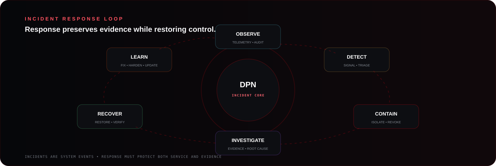

DPN incident response follows an evidence-preserving loop:

**Observe → Detect → Contain → Investigate → Recover → Learn**

Recovery is not complete until the restored state is verified and the lessons from the incident are converted into stronger controls, tests, monitoring or architecture.

Read [Incident Response](../INCIDENT_RESPONSE.md).

## Engineering Toolkit

<strong>Open the DPN engineering governance toolkit</strong>

| Resource | Use |
| --- | --- |
| [Governance](../GOVERNANCE.md) | Change classes, decision rules and review expectations |
| [ADR Template](../templates/ADR_TEMPLATE.md) | Record durable architecture decisions |
| [Threat Model Template](../templates/THREAT_MODEL_TEMPLATE.md) | Document assets, actors, trust boundaries and abuse cases |
| [Release Checklist](../templates/RELEASE_CHECKLIST.md) | Validate builds, security, artifacts and recovery before release |
| [Third-Party License Template](../templates/THIRD_PARTY_LICENSES_TEMPLATE.md) | Separate externally licensed components from DPN-owned code |

## Start Here

<table>
<tr>
<td width="33%">

### Explore public source

Open the [DPN FiveM Resource Library](https://github.com/DPN-Technology/DPN-QB-FiveM-Scripts) to inspect public code, architecture, documentation and project structure.

</td>
<td width="33%">

### Report a security issue

Use the affected repository's Security tab and follow the [organization security policy](../SECURITY.md). Do not publish exploit details in a normal issue.

</td>
<td width="33%">

### Contribute

Read [CONTRIBUTING.md](../CONTRIBUTING.md) and keep changes focused, evidence-backed and reviewable.

</td>
</tr>
</table>

## Public / Private Boundary

DPN Technology uses both public and private repositories.

**Public repositories** are intended for external visibility and collaboration.

**Private repositories** may contain active product development, internal tooling, infrastructure work, unreleased systems or operational material. The absence of a private project from this profile should not be interpreted as inactivity, abandonment or public availability.

## Organization Navigation

| Area | Public entry point |
| --- | --- |
| **Public source** | [DPN FiveM Resource Library](https://github.com/DPN-Technology/DPN-QB-FiveM-Scripts) |
| **Security** | Repository Security tabs and repository-specific security policies |
| **Issues** | Use the relevant public repository issue tracker |
| **Support** | [Organization support guidance](../SUPPORT.md) |
| **Contributing** | [Organization contribution standard](../CONTRIBUTING.md) |
| **Releases** | Use the relevant repository Releases page |

---

  <strong>DPN Technology</strong> 
  Develop • Pioneer • Navigate

