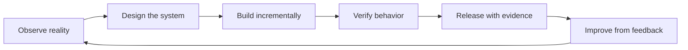

  

  <strong>We Develop what doesn’t exist. We Pioneer what comes next. We Navigate the future.</strong>

  
  
  
  

## DPN Technology

**DPN Technology** is an engineering organization focused on building practical software, infrastructure, AI tooling, operational systems, and interactive experiences.

Our work spans four connected domains:

  

| Domain | What we build |
| --- | --- |
| **Control & Infrastructure** | Operational visibility, identity, monitoring, automation, endpoint control, recovery and systems management |
| **Business Operations** | Workforce, service, retail, administration, internal operations and connected business tooling |
| **AI & Developer Systems** | Agent workflows, coding tools, research, memory, automation and software engineering systems |
| **Simulation & Interactive** | Industrial simulation, military simulation, community experiences and interactive software |

> Some DPN projects are developed privately and are intentionally not enumerated on this public profile. Public claims are kept tied to public evidence.

## Public Work

### DPN FiveM Resource Library

[**DPN-QB-FiveM-Scripts**](https://github.com/DPN-Technology/DPN-QB-FiveM-Scripts) is the current public repository in the DPN Technology organization.

It contains an expanding collection of QBCore, hybrid and standalone FiveM resources, including a unified emergency-services stack with dispatch, MDT, law-enforcement, medical and supporting systems.

  

## Engineering Principles

<table>
<tr>
<td width="50%">

### Evidence before claims

A polished interface is not proof that a capability is production-ready. DPN documentation is expected to distinguish prototypes, development systems, previews and validated releases.

### Security is a system property

Authentication, authorization, audit, secret handling, dependency hygiene, signed artifacts and recovery all matter. Security is not treated as one workflow file or one scanner.

</td>
<td width="50%">

### Recoverability matters

Systems should fail visibly, preserve evidence, support rollback and provide a path back to a known state.

### Local-first where practical

Many DPN systems are designed for self-hosted or local operation so owners retain control of infrastructure, data and runtime decisions.

</td>
</tr>
</table>

  

## How We Think About Systems

Every system should answer six questions:

1. **What problem does it solve?**
2. **What evidence proves it works?**
3. **Who or what is allowed to control it?**
4. **How does it fail?**
5. **How does it recover?**
6. **How does it integrate without becoming tightly coupled?**

## Security

Security issues should **not** be posted as public issues when disclosure could expose users, credentials, infrastructure or sensitive implementation details.

Use the repository's **Security** tab and private vulnerability reporting where available. Repository-specific `SECURITY.md` files take precedence over organization defaults.

## Contributing

Public contributions should be scoped, reviewable and evidence-backed. Pull requests should explain:

- the problem being solved;
- the implementation boundary;
- tests or verification performed;
- security or dependency impact;
- rollback considerations when applicable.

See the organization contribution guidance in the `.github` repository once published.

## Public / Private Boundary

DPN Technology uses both public and private repositories.

**Public repositories** are intended for external visibility and collaboration.

**Private repositories** may contain active product development, internal tooling, infrastructure work, unreleased systems or operational material. The absence of a private project from this profile should not be interpreted as inactivity, abandonment or public availability.

## Organization Navigation

| Area | Public entry point |
| --- | --- |
| **Public source** | [DPN FiveM Resource Library](https://github.com/DPN-Technology/DPN-QB-FiveM-Scripts) |
| **Security** | Repository Security tabs and repository-specific security policies |
| **Issues** | Use the relevant public repository issue tracker |
| **Releases** | Use the relevant repository Releases page |

---

  <strong>DPN Technology</strong> 
  Develop • Pioneer • Navigate

